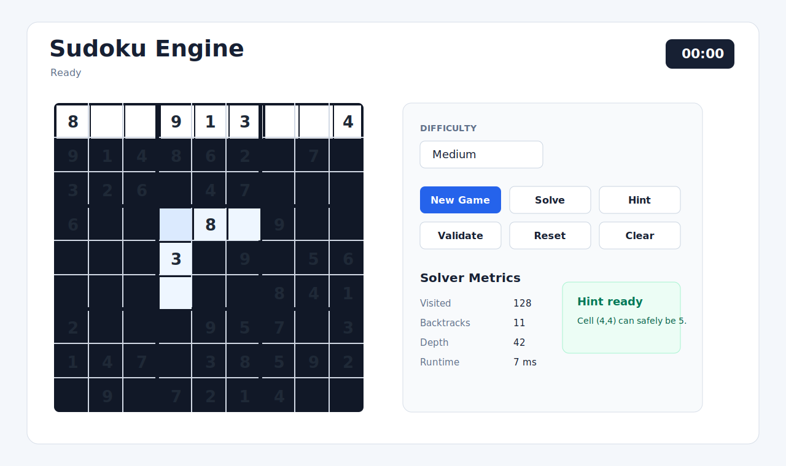
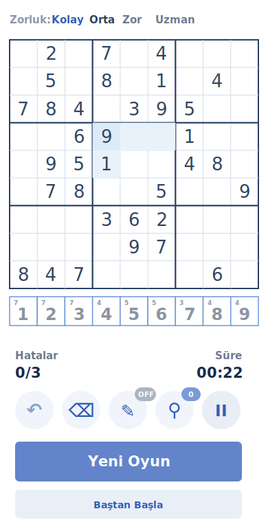

# Sudoku Engine

[](https://github.com/MuhammetDemir0/sudoku-engine/actions/workflows/ci.yml)
[](LICENSE)

Sudoku Engine is a full-stack Sudoku application with puzzle generation,
solving, validation, hints, difficulty analysis, and browser-based algorithm
visualization. The backend is Java 21 and Spring Boot; the frontend is a
modular vanilla JavaScript app served by the same Spring Boot process.

## Overview

The project is designed as a small but production-minded Sudoku platform:

- Generate puzzles by difficulty: `EASY`, `MEDIUM`, `HARD`, and `EXPERT`.
- Solve puzzles with performance metrics and optional step-by-step output.
- Validate row, column, and 3x3 box conflicts.
- Request safe hints without mutating the submitted board.
- Play Sudoku in a responsive browser UI with timer, reset, validation, hints,
  and solver visualization controls.

## Live Demo

Live deployment is configured for Render through `render.yaml`.

- Live URL: pending first hosted deployment
- Health endpoint: `/actuator/health`
- Deployment guide: [docs/deployment.md](docs/deployment.md)

After the Render service is created, add the public URL to this section and to
the GitHub repository Website field.

## Screenshots

Desktop interface:



Mobile interface:



## Features

- Static frontend served by Spring Boot; no separate frontend server is needed.
- Responsive 9x9 board with 3x3 box boundaries.
- Keyboard navigation, digit input, backspace/delete clearing, and locked clue
  cells.
- Client-side conflict detection for rows, columns, and boxes.
- Backend final validation for completed boards.
- New game flow with difficulty selection, loading state, and friendly errors.
- Hint endpoint integration with highlighted cells, explanation text, and hint
  usage count.
- Timer, reset flow, success message, and incorrect-completion handling.
- Backtracking visualization with play, pause, reset, speed control, step types,
  and solver metrics.
- Swagger UI and OpenAPI descriptions for the REST API.
- Global API exception handling with consistent error responses.
- Docker, Docker Compose, CI, coverage reporting, and production profile support.

## Architecture

```text
sudoku-engine/
+-- backend/                 # Spring Boot API, domain, services, tests, Maven build
|   +-- pom.xml
|   +-- src/main/java/com/sudokuengine
|   |   +-- controller/       # REST endpoints and API exception handling
|   |   +-- dto/              # HTTP request/response models
|   |   +-- model/            # Domain objects and enums
|   |   +-- service/          # Solver, generator, validation, difficulty, hints
|   |   +-- config/           # OpenAPI and threshold configuration
|   +-- src/main/resources    # Spring profiles and database schema
+-- frontend/                # Browser UI source copied into Spring static assets
|   +-- index.html
|   +-- css/
|   +-- js/
+-- docs/                    # Project documentation and screenshots
+-- pom.xml                  # Parent Maven build for IDE and root-level verify
+-- Dockerfile               # Multi-stage production image
+-- docker-compose.yml       # Local container startup
+-- render.yaml              # Live deployment blueprint
+-- .github/workflows/ci.yml # GitHub Actions CI pipeline
```

The domain model is kept separate from API DTOs. Controllers accept validated
request DTOs, map them to domain objects, call focused services, and return
response DTOs. During Maven builds, the `frontend/` folder is copied into
`target/classes/static`, which lets Spring Boot serve the UI and API from the
same runtime.

## Algorithms

- `BacktrackingSudokuSolver` performs depth-first solving and can emit place and
  remove steps for visualization.
- `MrvSudokuSolver` uses the minimum remaining values heuristic to choose the
  next constrained empty cell.
- `SudokuValidator` reports all row, column, and box violations without exposing
  implementation details.
- `UniqueSudokuPuzzleGenerator` creates puzzles and verifies uniqueness before
  returning them.
- `DifficultyAnalysisService` classifies puzzles using clue count and solver
  metrics, with thresholds centralized in configuration.
- `HintService` validates the board, solves a defensive copy, and returns a safe
  next cell/value with a reason.

More detail on difficulty thresholds is available in
[docs/difficulty.md](docs/difficulty.md). Deeper design notes are split across
[docs/architecture.md](docs/architecture.md), [docs/solver.md](docs/solver.md),
[docs/generator.md](docs/generator.md), and [docs/api.md](docs/api.md).

## Setup

Requirements:

- Java 21
- Maven 3.9+
- Docker and Docker Compose for container workflows

Run locally with Maven:

```bash
mvn spring-boot:run -pl backend -Dspring-boot.run.profiles=dev
```

Open:

```text
http://localhost:8080
```

Run the packaged JAR:

```bash
mvn -B -pl backend -am package
java -jar backend/target/sudoku-engine-1.0.0.jar --spring.profiles.active=dev --server.port=8080
```

Run with Docker:

```bash
docker build -t sudoku-engine:local .
docker run --rm -p 8080:8080 -e PORT=8080 -e SPRING_PROFILES_ACTIVE=prod sudoku-engine:local
```

Run with Docker Compose:

```bash
docker compose up --build
```

Optional PostgreSQL and pgAdmin services are available through the `database`
profile. Secrets are provided from the shell and are not stored in the
repository:

```bash
POSTGRES_PASSWORD=change-me PGADMIN_DEFAULT_PASSWORD=change-me docker compose --profile database up --build
```

## Configuration

Profiles are selected externally with `SPRING_PROFILES_ACTIVE`.

- `dev`: local H2 database, H2 console enabled, application DEBUG logs by
  default.
- `prod`: H2 console disabled, restricted actuator details, INFO logs by
  default.
- `postgres`: optional database profile that reads credentials from environment
  variables.

Common environment variables:

```text
PORT
LOG_LEVEL_ROOT
LOG_LEVEL_APP
DATABASE_URL
DATABASE_USERNAME
DATABASE_PASSWORD
```

## API

Base path:

```text
/api/v1/puzzles
```

Generate a puzzle:

```http
POST /api/v1/puzzles/generate
Content-Type: application/json

{
  "difficulty": "MEDIUM"
}
```

Solve a board:

```http
POST /api/v1/puzzles/solve
Content-Type: application/json

{
  "board": [
    [5,3,0,0,7,0,0,0,0],
    [6,0,0,1,9,5,0,0,0],
    [0,9,8,0,0,0,0,6,0],
    [8,0,0,0,6,0,0,0,3],
    [4,0,0,8,0,3,0,0,1],
    [7,0,0,0,2,0,0,0,6],
    [0,6,0,0,0,0,2,8,0],
    [0,0,0,4,1,9,0,0,5],
    [0,0,0,0,8,0,0,7,9]
  ],
  "includeSteps": true,
  "solver": "MRV"
}
```

Validate a board:

```http
POST /api/v1/puzzles/validate
Content-Type: application/json

{
  "board": [
    [5,3,0,0,7,0,0,0,0],
    [6,0,0,1,9,5,0,0,0],
    [0,9,8,0,0,0,0,6,0],
    [8,0,0,0,6,0,0,0,3],
    [4,0,0,8,0,3,0,0,1],
    [7,0,0,0,2,0,0,0,6],
    [0,6,0,0,0,0,2,8,0],
    [0,0,0,4,1,9,0,0,5],
    [0,0,0,0,8,0,0,7,9]
  ]
}
```

Request a hint:

```http
POST /api/v1/puzzles/hint
Content-Type: application/json

{
  "board": [
    [5,3,0,0,7,0,0,0,0],
    [6,0,0,1,9,5,0,0,0],
    [0,9,8,0,0,0,0,6,0],
    [8,0,0,0,6,0,0,0,3],
    [4,0,0,8,0,3,0,0,1],
    [7,0,0,0,2,0,0,0,6],
    [0,6,0,0,0,0,2,8,0],
    [0,0,0,4,1,9,0,0,5],
    [0,0,0,0,8,0,0,7,9]
  ]
}
```

Boards must be 9x9 integer matrices containing values from `0` to `9`, where
`0` means empty. Swagger UI is available at:

```text
http://localhost:8080/swagger-ui.html
```

## Testing

Run all checks from the repository root:

```bash
mvn -B verify
```

The test suite covers domain models, validation, solvers, generator behavior,
difficulty analysis, hinting, DTO validation, REST endpoints, static frontend
serving, and Selenium browser flows. JaCoCo enforces at least 80% line coverage.

Verify Docker packaging:

```bash
docker build -t sudoku-engine:local .
```

The GitHub Actions workflow runs on pull requests and on pushes to `main`.
Feature-branch pushes no longer create a duplicate PR check.

## Roadmap

- Publish the first Render live URL and update the repository Website field.
- Add persistent user game history and saved puzzle sessions.
- Add richer visualization controls for strategy comparison.
- Add accessibility audits to CI.
- Add production database migration tooling before storing durable user data.

## License

This project is licensed under the MIT License. See [LICENSE](LICENSE).
