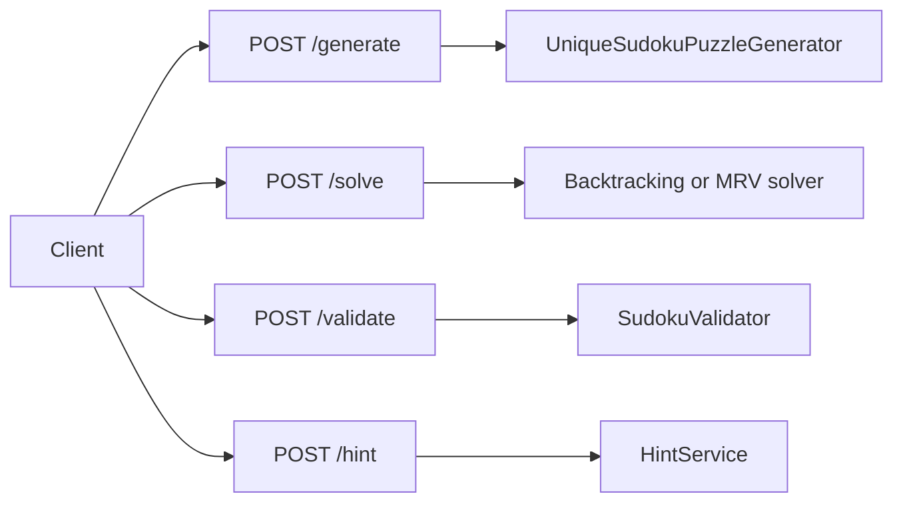
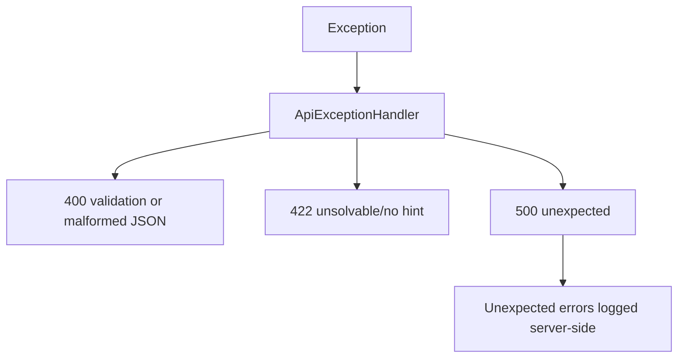

# REST API

The API is exposed under `/api/v1/puzzles`. Controllers accept DTO request
objects, validate them with Bean Validation, map them to domain models, and
return DTO responses.

## Endpoint Map



## Board Format

A board is a 9x9 integer matrix. Values must be between `0` and `9`; `0` means
an empty cell.

```json
[
  [5, 3, 0, 0, 7, 0, 0, 0, 0],
  [6, 0, 0, 1, 9, 5, 0, 0, 0],
  [0, 9, 8, 0, 0, 0, 0, 6, 0],
  [8, 0, 0, 0, 6, 0, 0, 0, 3],
  [4, 0, 0, 8, 0, 3, 0, 0, 1],
  [7, 0, 0, 0, 2, 0, 0, 0, 6],
  [0, 6, 0, 0, 0, 0, 2, 8, 0],
  [0, 0, 0, 4, 1, 9, 0, 0, 5],
  [0, 0, 0, 0, 8, 0, 0, 7, 9]
]
```

## Generate

```http
POST /api/v1/puzzles/generate
Content-Type: application/json

{
  "difficulty": "MEDIUM"
}
```

Returns a puzzle and difficulty. The full solution is intentionally not exposed.

## Solve

```http
POST /api/v1/puzzles/solve
Content-Type: application/json

{
  "board": [[...]],
  "includeSteps": true,
  "solver": "MRV"
}
```

Returns whether the board was solved, the solved board when available, solver
metrics, and optional visualization steps.

## Validate

```http
POST /api/v1/puzzles/validate
Content-Type: application/json

{
  "board": [[...]]
}
```

Returns `valid=true` or all detected rule violations. Row, column, and box
violations can appear in the same response.

## Hint

```http
POST /api/v1/puzzles/hint
Content-Type: application/json

{
  "board": [[...]]
}
```

Returns a safe next move with `row`, `col`, `value`, and `reason`. Invalid boards
return a clear API error. Completed boards return `204 No Content`.

## Error Handling



All API errors use `ApiErrorResponse`. Stack traces and implementation details
are not returned to clients.
