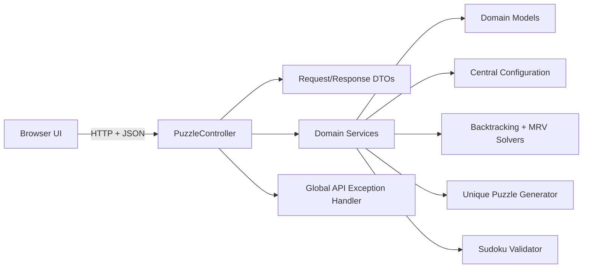
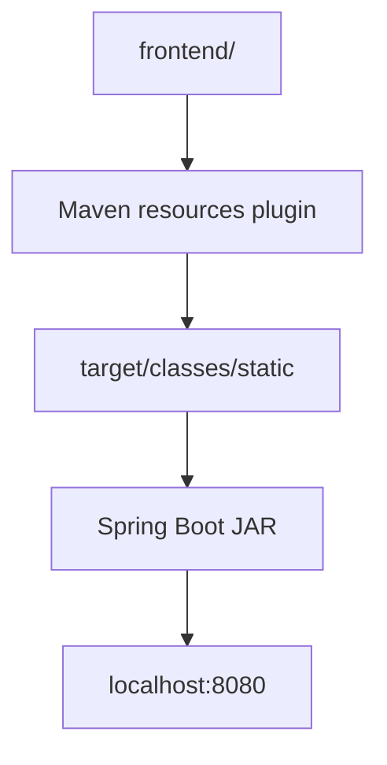
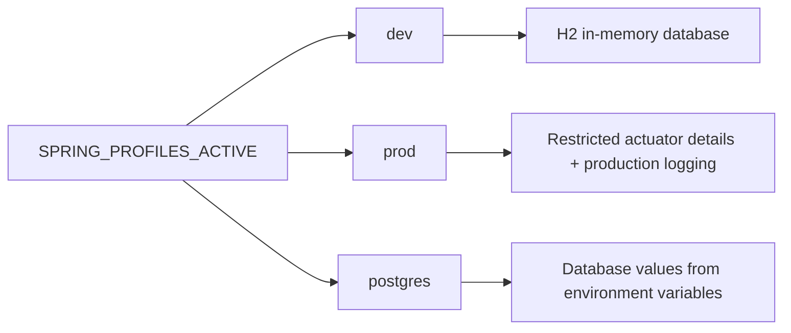

# Architecture

Sudoku Engine is a single Spring Boot application that serves both the REST API
and the static browser UI. The frontend source is kept in the top-level
`frontend/` directory, then copied into Spring Boot static resources during the
Maven build.

## Runtime View



## Repository Layout

```text
sudoku-engine/
+-- backend/
|   +-- src/main/java/com/sudokuengine
|   |   +-- controller/
|   |   +-- dto/
|   |   +-- model/
|   |   +-- service/
|   |   +-- config/
|   +-- src/main/resources/
+-- frontend/
|   +-- index.html
|   +-- css/
|   +-- js/
+-- docs/
```

## Layer Responsibilities

| Layer | Responsibility |
| --- | --- |
| Frontend | Renders the board, handles keyboard and mobile interaction, calls API endpoints, and displays user feedback. |
| Controller | Exposes HTTP endpoints and keeps transport concerns out of the domain model. |
| DTO | Defines request and response shapes with Bean Validation annotations. |
| Service | Implements Sudoku solving, validation, generation, difficulty analysis, and hints. |
| Model | Represents boards, puzzles, hints, solving steps, metrics, and violations. |
| Config | Keeps thresholds, OpenAPI metadata, and environment-specific properties centralized. |
| Exception handling | Maps validation, domain, JSON, and unexpected failures to consistent API errors. |

## Static Frontend Packaging



The frontend is modular JavaScript without a separate build server. This keeps
local execution and deployment simple: one Spring Boot process serves both
`/api/v1/puzzles/**` and `/`.

## Environment Profiles



Profiles are selected externally. Production secrets are not committed; database
credentials are read from environment variables.
