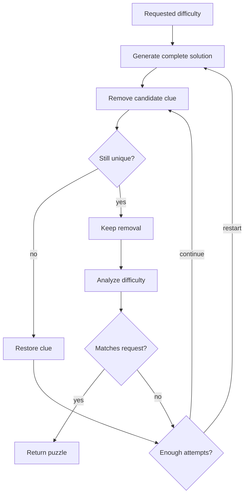
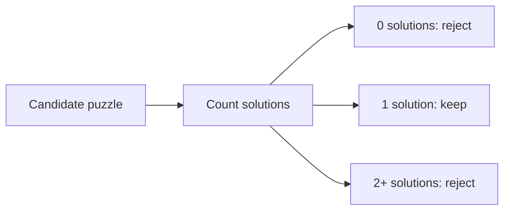

# Puzzle Generator

The generator creates a complete solved board, removes values, and verifies that
the resulting puzzle has a unique solution and the requested difficulty.

## Generation Flow

## Unique-Solution Checking

Unique-solution checking is the safety gate. After each clue removal, the
generator asks the solver to count solutions up to a small limit. The puzzle is
accepted only when exactly one solution exists.

This prevents ambiguous puzzles where multiple completed boards satisfy the same
givens.

## Difficulty Targeting

Difficulty is not guessed from clue count alone. The generator combines:

- clue-count ranges for each requested difficulty
- solver effort metrics from the analyzer
- centralized thresholds from `DifficultyThresholdConfig`

The generator retries when a puzzle is unique but does not match the requested
difficulty.

## Determinism

Generator tests use fixed random seeds so failures are reproducible. Production
generation can still use randomization for varied puzzles.
