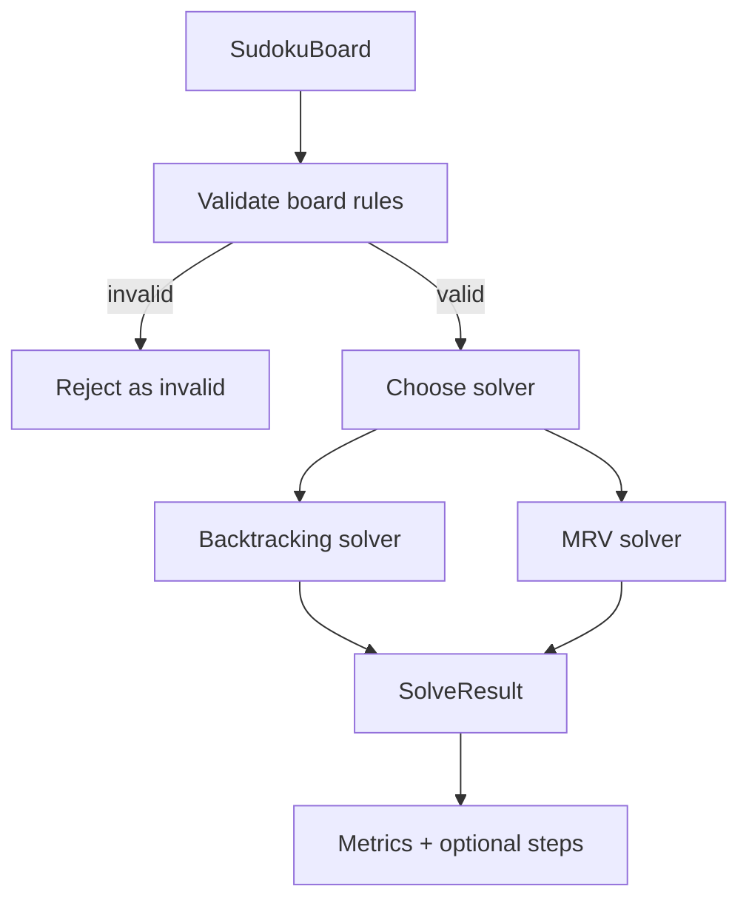
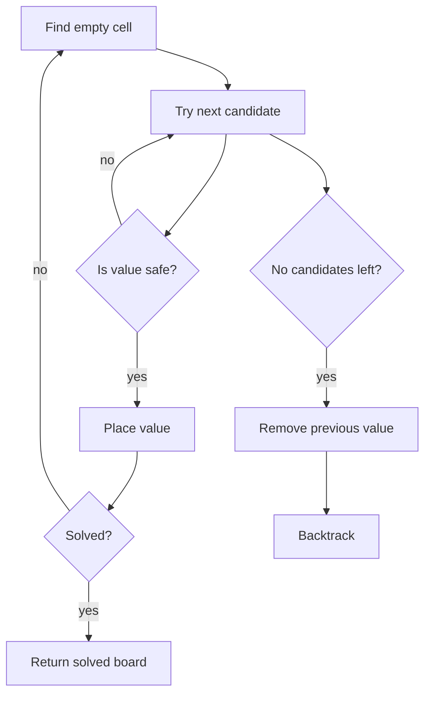
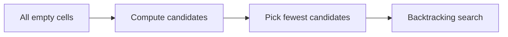

# Solver Algorithms

The solver layer provides two solving strategies that share the same domain
contract and metrics model.

## Solver Flow

## Backtracking

Backtracking is a depth-first search:

1. Find the next empty cell.
2. Try candidate values `1` through `9`.
3. Keep a value only if it does not break row, column, or box rules.
4. Recurse to the next empty cell.
5. If no candidate works, remove the value and backtrack.

When `includeSteps=true`, the solver records `PLACE_VALUE` and `REMOVE_VALUE`
steps so the frontend can animate the search.

## MRV

MRV means Minimum Remaining Values. Instead of selecting the first empty cell,
the solver chooses the empty cell with the fewest valid candidates. This usually
reduces the search tree because constrained cells fail faster.

## Metrics

Both solvers report:

- visited nodes
- backtrack count
- maximum recursion depth
- elapsed time in nanoseconds
- optional solving steps

These metrics are used by API responses, visualization, tests, and difficulty
analysis.
